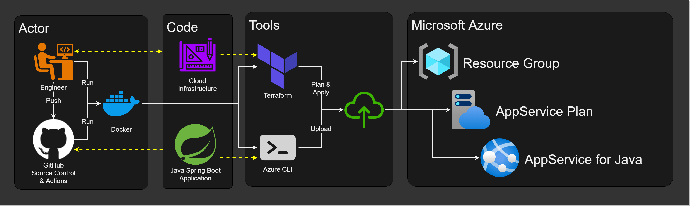

# Tutorials: Java on Azure

## Steps

1. [Create a new AppService][tutorials-infrastructure] in Azure using Terraform.
2. [Deploy a Java application][tutorials-app] to Azure using the Azure CLI.

[tutorials-infrastructure]: ./infrastructure/#readme
[tutorials-app]: ./app/#readme
